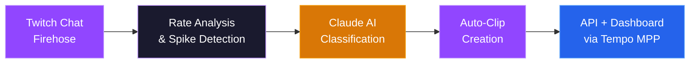
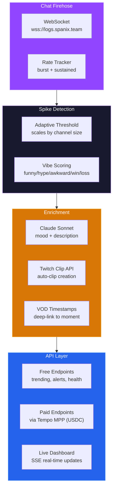

# clippy

**MPP Hackathon · Tempo x Stripe · Built in person at Tempo HQ, San Francisco**

**Real-Time Twitch Stream Intelligence, Powered by Micropayments**

Detect the spike. Clip the moment. Pay per insight.

[](https://typescriptlang.org)
[](https://twitch.tv)
[](https://anthropic.com)
[](https://tempo.xyz)

---

## What is Clippy?

Clippy monitors every major Twitch stream in real time, detects chat activity spikes, classifies moments with AI, and auto-clips highlights — all accessible through a pay-per-use API powered by Tempo's Micropayment Protocol.



### Why?

- Twitch generates **millions of chat messages per minute** — impossible to watch everything
- Chat spikes are the strongest signal for **clip-worthy moments** (kills, fails, drama, raids)
- Existing clip tools require manual effort — Clippy is **fully autonomous**
- Tempo MPP enables **per-request and per-event pricing** without subscriptions or API keys

Clippy connects the firehose to the highlight reel: **Chat Spike** (the signal) → **AI Classification** (the context) → **Auto-Clip** (the product).

---

## Architecture



---

## Features

| | Feature | Details |
|-|---------|---------|
| **Firehose** | Real-Time Chat Ingestion | WebSocket connection to all major Twitch channels |
| **Detection** | Adaptive Spike Detection | Dual-window analysis (5s burst + 30s sustained), scales by channel size |
| **AI** | Claude Classification | Mood tagging, moment descriptions, clip-worthiness scoring |
| **Clips** | Auto-Clip Creation | Automatic Twitch clips with AI-generated titles at spike timestamps |
| **Vibes** | Chat Vibe Scoring | Pattern-matched mood detection (funny, hype, awkward, win, loss) |
| **VOD** | Timestamp Enrichment | Deep-links to exact VOD moments with embedded player |
| **API** | Pay-Per-Use Endpoints | Micropayment-gated access via Tempo MPP in USDC |
| **Dashboard** | Live Monitoring UI | Real-time trending channels, active spikes, and clip feed |
| **Alerts** | SSE Spike Stream | Server-sent events for live spike notifications, filterable by channel |

---

## Spike Detection — How It Works

```
Every second, per channel:
  burst     = messages in last 5s     (instant reaction)
  sustained = messages in last 30s    (confirms real activity)
  baseline  = avg of non-zero bursts  (excludes dead silence)

Spike triggers when:
  burst > baseline * max(1.5, 2.5 - baseline * 0.1)
  └── threshold scales dynamically: big channels need lower % jump

Filters:
  • 3000+ concurrent viewers required
  • 30s debounce between spikes per channel
  • 40%+ chat jump for moment capture
```

---

## API Endpoints

### Free

| Method | Endpoint | Description |
|--------|----------|-------------|
| `GET` | `/api` | Service info |
| `GET` | `/health` | Status + stats |
| `GET` | `/trending` | Top 10 trending channels |
| `GET` | `/alerts` | SSE spike stream (filterable) |
| `GET` | `/moments/:id` | Moment details |
| `GET` | `/moments/latest/:channel` | Latest moment for a channel |
| `GET` | `/channel-stats/:name` | Live channel rates + vibes |
| `GET` | `/clip/:id` | Embedded clip player with chat snapshot |

### Paid (Tempo MPP · USDC)

| Method | Endpoint | Cost | Description |
|--------|----------|------|-------------|
| `POST` | `/trending` | $0.001 | Full trending with custom limit |
| `POST` | `/channel` | $0.001 | Full channel stats + chat |
| `POST` | `/spikes` | $0.002 | All active spikes with VOD enrichment |
| `POST` | `/summarize` | $0.01 | LLM summary of channel chat |
| `POST` | `/moments` | $0.001 | Query moments by filter |
| `POST` | `/watch/:channel` | $0.03/spike | Live monitoring + AI classification + auto-clip |

---

## Quick Start

```bash
git clone https://github.com/your-repo/clippy.git && cd clippy
npm install
cp .env.example .env   # add Twitch + Tempo credentials
npm run dev             # starts on :3000
```

### Environment Variables

```
TWITCH_CLIENT_ID        # Twitch app client ID
TWITCH_CLIENT_SECRET    # Twitch app client secret
TWITCH_ACCESS_TOKEN     # OAuth token for clip creation
TEMPO_SESSION_KEY       # MPP session key
ANTHROPIC_API_KEY       # Claude API key (used via MPP)
```

---

## Project Structure

```
src/
  index.ts              Express app, route handlers, payment setup
  firehose.ts           Twitch chat WebSocket, rate analysis, spike detection
  moments.ts            Moment capture, storage, watchlist management
  clip.ts               Twitch OAuth, clip creation logic
  summarize.ts          LLM calls via MPP, mood classification, chat summary

public/
  index.html            Dashboard — trending, spikes, watched channels
  demo.html             Pipeline visualization demo
  docs.html             API documentation + usage examples
  llms.txt              LLM agent discovery file
```

---

## Tech Stack

**Backend** — Node.js, Express 5, TypeScript, WebSocket (ws)
**AI** — Claude Sonnet via Tempo MPP
**Payments** — Tempo MPP, Viem, USDC on Tempo Chain
**Twitch** — Helix API, OAuth, Chat Firehose
**Frontend** — Vanilla JS, SSE, responsive dark UI
**Infra** — Railway

---

## Payment Model

Clippy uses Tempo's Micropayment Protocol for two payment types:

- **Charge** — one-time per-request fee, settled immediately on-chain
- **Session** — deposit escrow with off-chain vouchers per event, unused balance refunded on disconnect

All payments settle in **USDC** on Tempo mainnet.

---

<p align="center">
  <strong>Detect the spike. Clip the moment. Pay per insight.</strong>
  <br /><br />
  Built in person at Tempo HQ, San Francisco — MPP Hackathon (Tempo x Stripe)
</p>
